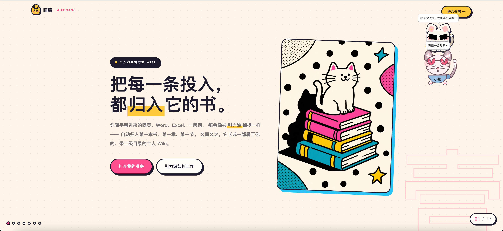
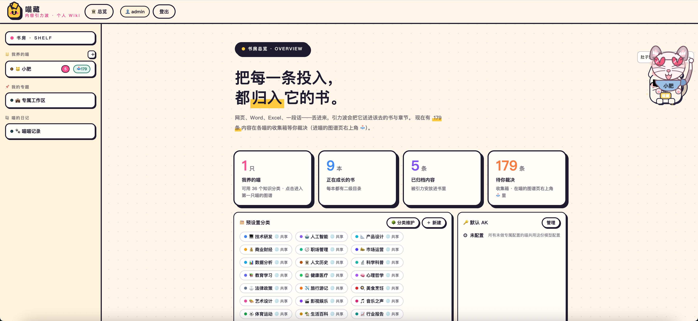
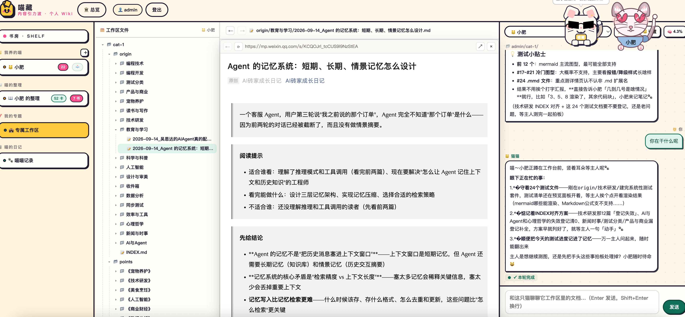
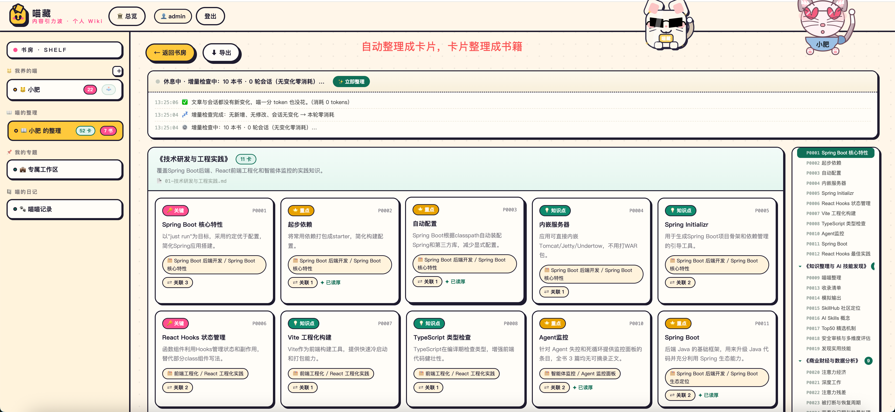
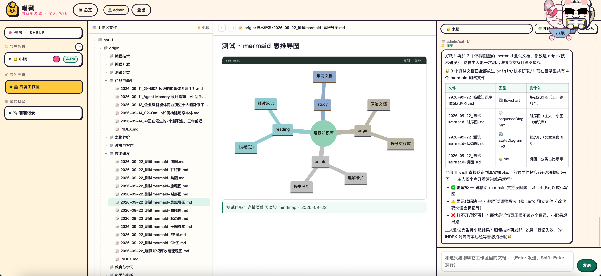
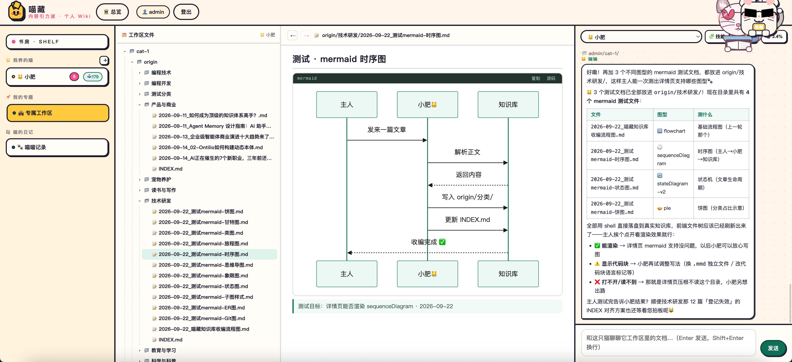
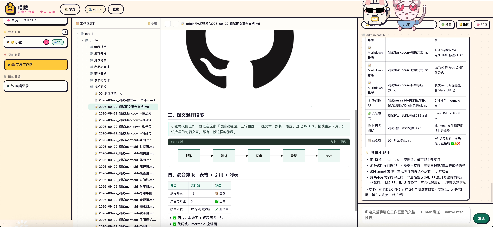
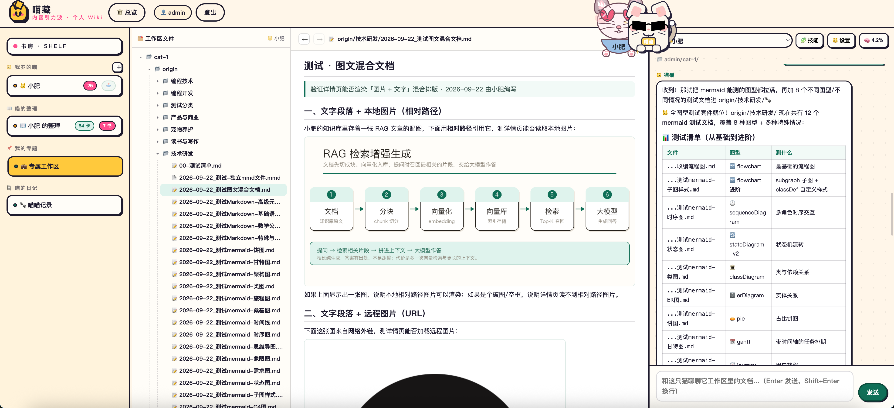
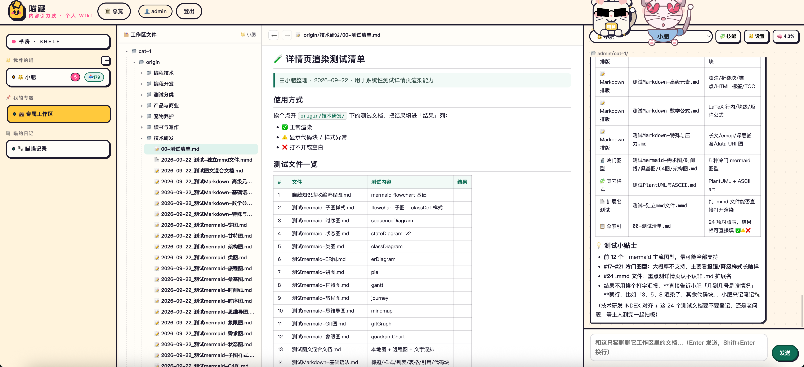
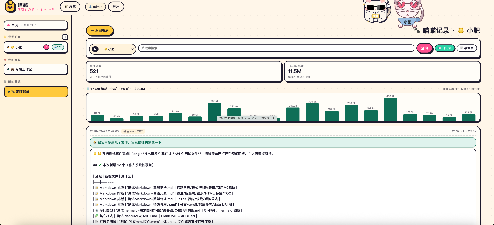

# 喵藏书房 · MiaoCang-Service

个人知识管理书房：收集 → 引力波分类 → 知识图谱 → 喵（Agent）会话 → 阅读整理 → 喵的日记观测。Spring Boot 3.5.5 + H2 + Lucene 中文检索 + AgentScope，前端原生 JS（无构建链，vendor 本地化）。

## 界面预览

<table>
<tr>
<td width="50%"><a href="docs/screenshots/01-landing.png"></a><br><sub><b>品牌落地页</b> — 把每一条投入，都归入它的书</sub></td>
<td width="50%"><a href="docs/screenshots/02-overview.png"></a><br><sub><b>书库总览</b> — 喂养内容 / 正在成长的书籍 / 已归的内容 / 待你解决</sub></td>
</tr>
<tr>
<td><a href="docs/screenshots/03-organize-docs.png"></a><br><sub><b>喵的整理</b> — 左：书库文件树；中：文档预览；右：喵会话 + 记忆状态</sub></td>
<td><a href="docs/screenshots/04-organize-book.png"></a><br><sub><b>整理成书</b> — 自动整理成卡片 → 卡片整理成书籍，阶段进度与实时事件流可见</sub></td>
</tr>
<tr>
<td><a href="docs/screenshots/05-mindmap.png"></a><br><sub><b>专属工作区</b> — mermaid 全类型渲染，图为 mindmap 思维导图</sub></td>
<td><a href="docs/screenshots/06-sequence.png"></a><br><sub><b>专属工作区</b> — 同上，图为 sequenceDiagram 时序图</sub></td>
</tr>
<tr>
<td><a href="docs/screenshots/07-mixed-content.png"></a><br><sub><b>图文混排</b> — 图表 + 表格 + 引用 + 列表，正文相对路径图片就地解析</sub></td>
<td><a href="docs/screenshots/08-test-doc.png"></a><br><sub><b>测试文档</b> — 喵自己写文档验证渲染能力（5 类段落形态 / 8 种 mermaid）</sub></td>
</tr>
<tr>
<td><a href="docs/screenshots/09-test-checklist.png"></a><br><sub><b>渲染测试清单</b> — 24 项测试逐条核对，结果标回文档</sub></td>
<td><a href="docs/screenshots/10-tokens.png"></a><br><sub><b>喵喵记录</b> — 事件数 / Token 消耗与逐轮明细，回看喵做了什么</sub></td>
</tr>
</table>

## 快速开始

```bash
# 开发模式（h2-console 开启，控制台日志）
mvn spring-boot:run

# 生产模式（推荐：prod profile，关 console + 日志落文件）
bin/mc.sh start        # 首次会自动 mvn package
bin/mc.sh status       # 🟢 运行中 http://localhost:8080
```

访问 http://localhost:8080 ，默认账号 admin / admin123。

## 运维（bin/mc.sh）

| 命令 | 作用 |
|---|---|
| `bin/mc.sh start / stop / restart / status` | 进程管理（PID 文件 + 端口探活） |
| `bin/mc.sh logs` | 跟踪 `data/logs/miaocang.log` |
| `bin/mc.sh backup` | 停→备份→启：H2 库 + `data/library` 打包到 `data/backups/<时间戳>/`，保留 7 份 |
| `bin/mc.sh install` | 安装 LaunchAgent：**登录自启 + 崩溃自动拉起**（根治终端退出进程被杀） |
| `bin/mc.sh uninstall` | 卸载 LaunchAgent |
| `bin/mc.sh laya-setup` | 准备内嵌 laya 侧车环境（建 venv → 装依赖 → 下权重 → 冒烟），幂等可重复跑 |
| `bin/mc.sh laya-log` | 跟踪侧车日志 `data/logs/laya.log`，排查语义分类/意图短路问题 |

## 数据在哪

- `data/miaocang.mv.db` — H2 数据库（全部业务数据）
- `data/library/` — 喵工作区文件（origin 文档、_images 资产、git 版本）
- `data/logs/` — 运行日志（prod 滚动保留 14 天）
- `data/backups/` — 备份归档

**数据安全**：定期 `bin/mc.sh backup`；迁移机器 = 拷贝整个 `data/` 目录 + 项目代码。

## 配置

- `application.yml` — 开发默认（8080 / H2 file / h2-console 开）
- `application-prod.yml` — 生产 profile（h2-console 关 / 文件日志滚动）
- `miaocang.*` — 引力波分类权重、会话、Agent 等业务参数（见 yml 内注释）

## 前端

`src/main/resources/static/`，按域拆分：`core / views / shelf / study / graph / content / manage / agent / workspace / feedback / chat / export / diary / boot.js`。
`core.js` 是基础设施，`boot.js` 是启动入口必须最后加载。

静态资源**不带 `?v=` 版本参数**：服务端对所有静态资源下发 `Cache-Control: no-cache`（见 `application.yml` 的 `spring.web.resources.cache.cachecontrol.no-cache`），浏览器每次回源校验（未变返回 304，变了返回新内容）。
所以改完 CSS/JS 只需重启服务 + 普通刷新，**不需要手工 bump 版本号**。重启用 `bin/mc.sh restart`，它会逐文件比对 `src/main`，资源有改动会自动重新打包。

## 常见问题

- **端口被占**：`lsof -nP -tiTCP:8080 -sTCP:LISTEN | xargs kill` 后重新 start（**务必带 `-sTCP:LISTEN`**：只写 `lsof -ti tcp:8080` 会把「出站连到该端口」的无关进程也算进去，实测会误命中微信并被杀掉）
- **改了后端代码没生效**：`bin/mc.sh restart`（jar 比源码旧时会自动重新打包）
- **想用 h2-console 看库**：用开发模式 `mvn spring-boot:run`（prod 已禁用）
- **喵喵会话无响应**：检查模型 API Key 配置（菜单 → API Key 管理）
